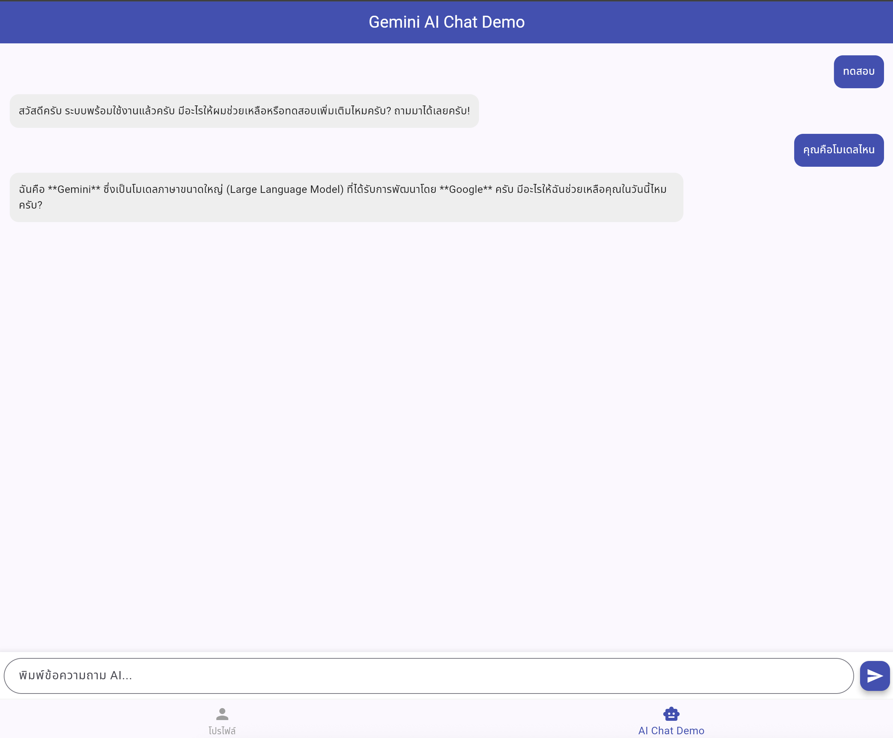

# 📱 MDAD Week 1 - Lab Sheet 1: ปฐมนิเทศ & แนะนำ Mobile Development

คลังข้อมูลใบงานการทดลองที่ 1 รายวิชา **การพัฒนาซอฟต์แวร์สำหรับอุปกรณ์เคลื่อนที่ (Mobile Software Development - MDAD)** หัวข้อ **"ปฐมนิเทศ & แนะนำ Mobile Development — Flutter, Dart & Google AI Studio"** ของนักศึกษารหัส **67030011**

---

## 📌 ตำแหน่งไฟล์ใบงานและรายงาน (Quick Links)

| 📁 เอกสาร / โปรเจกต์ | 🔗 ลิงก์เข้าถึง |
| :--- | :--- |
| 📘 **ใบงานหลัก (Lab Sheet v2)** | [📄 MDAD-week01_lab_v2.md](./MDAD-week01_lab_v2.md) |
| 📝 **รายงานผลการทดลอง (Lab Report)** | [📄 LAB_REPORT.md](https://github.com/Kritternai/week01-flutter-intro-67030011/blob/main/LAB_REPORT.md) |
| 🚀 **โปรเจกต์ Flutter & ซอร์สโค้ด (GitHub Repo)** | [🔗 Kritternai/week01-flutter-intro-67030011](https://github.com/Kritternai/week01-flutter-intro-67030011) |
---

## 📸 ผลการทดลองและตัวอย่างหน้าจอแอปพลิเคชัน (Experiment Results & Screenshots)

ภาพผลลัพธ์จากการทดลองปฏิบัติการในใบงานที่ 1 ซึ่งได้ทำการตั้งค่าสภาพแวดล้อม (VS Code Workflow) และพัฒนาแอปพลิเคชันด้วย Flutter และ Google Gemini API:

### 1. การตรวจสอบสภาพแวดล้อมการพัฒนา (`flutter doctor`)
การตั้งค่าเครื่องมือพัฒนาโดยใช้ **VS Code Workflow** ร่วมกับ Android SDK Command-line Tools (ประหยัดพื้นที่และทำงานได้รวดเร็ว):

---

### 2. แอปพลิเคชันแนะนำตัว (Profile Card App)
แอปพลิเคชันแสดงข้อมูลส่วนตัว ข้อมูลติดต่อ และทักษะความสามารถ (Skill Tags) สร้างด้วย Flutter Stateless/Stateful Widgets และตกแต่ง UI แบบ Modern:

---

### 3. แอปพลิเคชันแชทอัจฉริยะ (AI Chat App with Gemini API)
แอปพลิเคชันพูดคุยโต้ตอบแบบ Real-time โดยเชื่อมต่อกับ **Google Gemini API** (`gemini-1.5-flash`) ผ่าน `google_generative_ai` package:

---

## 🎯 สรุปสิ่งที่ได้เรียนรู้จากใบงาน (Learning Outcomes)
* **VS Code Workflow:** เข้าใจข้อดีของการพัฒนา Flutter ใน VS Code โดยไม่ต้องติดตั้ง Android Studio ตัวเต็ม
* **Dart & Flutter Basics:** เข้าใจความแตกต่างและการใช้งาน `StatelessWidget` และ `StatefulWidget`
* **AI Integration:** สามารถเชื่อมต่อ Google Gemini API เข้ากับแอปพลิเคชัน Flutter เพื่อสร้าง Generative AI Features
* **Git & Security Best Practices:** รู้วิธีจัดการ API Key อย่างปลอดภัยด้วย `.env` และ `.gitignore` เพื่อไม่ให้ความลับหลุดสู่สาธารณะ

---
*จัดทำสำหรับส่งงานวิชา Mobile Software Development (MDAD 2026) — รหัสนักศึกษา 67030011*
